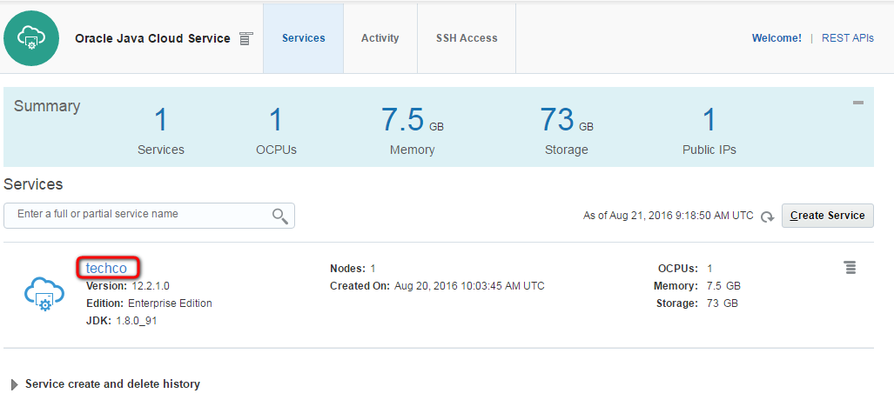
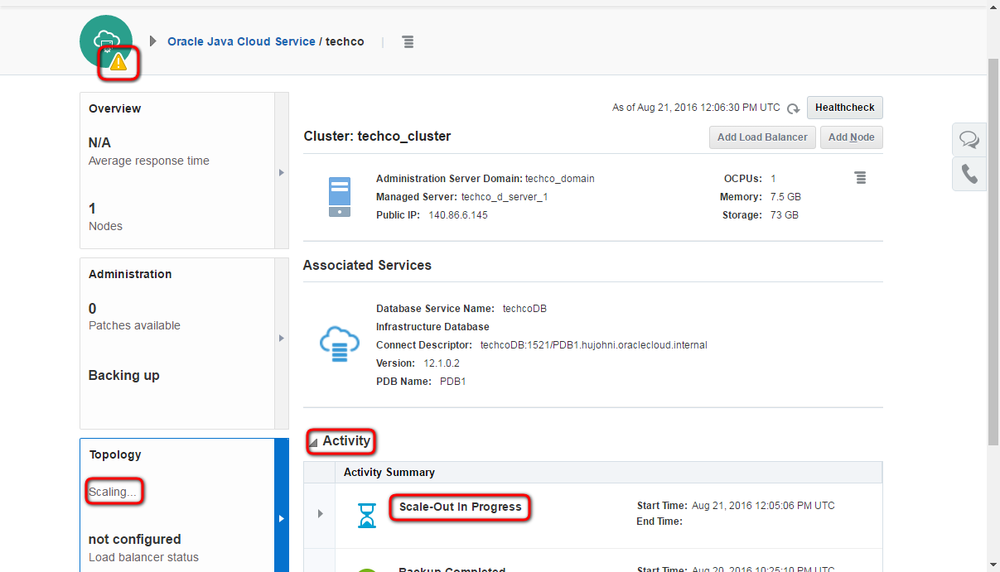

# ORACLE Public Cloud Service tutorial #
-----
## Scaling Out an Oracle Java Cloud Service Cluster ##

### About this tutorial ###
You can scale out an Oracle Java Cloud Service cluster to add one node to the cluster. When you scale out, Oracle Java Cloud Service creates a new VM running a WebLogic Server Managed Server instance.

You can also scale up the node, for more information about scaling an Oracle Java Cloud Service Instance see the [documentation](https://docs.oracle.com/cloud/latest/jcs_gs/JSCUG/GUID-02D79DE3-643B-44B9-A979-340BD472B529.htm#JSCUG3289).

### Prerequisites ###

- [Deployed sample application on Java Cloud Service](https://github.com/oracle-weblogic/weblogic-innovation-seminars/blob/caf-12.2.1/cloud.demos/jcs.basics/deploy.to.jcs.md)

### Steps ###
Navigate to the Oracle Java Cloud Service Console. [Sign in](https://github.com/oracle-weblogic/weblogic-innovation-seminars/blob/caf-12.2.1/cloud.demos/jcs.basics/sign.in.to.oracle.cloud.md) to the My Services application at [cloud.oracle.com](http://cloud.oracle.com). On the dashboard open the Java Cloud Service Console.

Click the service instance hosts sample application.

Navigate to the Topology page. Click Add Node.

To confirm you want to scale out the cluster, click Add Node.

After a few moments the Topology tile will show Scaling... and the service instance will change to maintenance mode (yellow exclamation mark). If it has not changed click the Refresh icon to update the page. You can also click Activity to check in the history that Scale-Out is in progress.

The VM of the new node has the compute shape and the amount of storage with which the service instance was originally created. If necessary, you can change the compute shape and add storage as explained in [Scaling an Oracle Java Cloud Service Node](https://docs.oracle.com/cloud/latest/jcs_gs/JSCUG/GUID-8DD460BA-708C-4B90-822F-4E4D64C59F77.htm#GUID-8DD460BA-708C-4B90-822F-4E4D64C59F77).