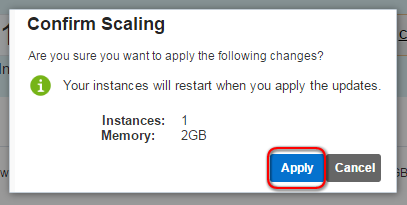
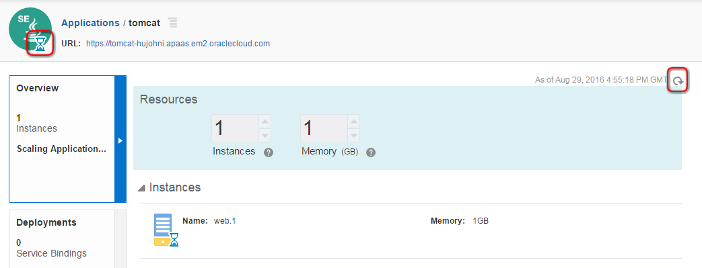

# ORACLE Public Cloud Service tutorial #
-----
## Scale up/down Application Container Service using user interface and psm CLI tool ##

### About this tutorial ###
Oracle Application Container Cloud Service includes Oracle Java SE Cloud Service and Oracle Node Cloud Service. It provides a lightweight infrastructure so that you can run Java SE 7, Java SE 8, and Node.js applications in the Oracle Cloud.

This tutorial demonstrates how to:

+ scale up Application Cloud Service instance using user interface
+ scale down Application Cloud Service instance using psm command line interface tool.
	
### Prerequisites ###

+ [Deploy Tomcat sample application to Oracle Application Container Cloud](https://github.com/oracle-weblogic/weblogic-innovation-seminars/blob/caf-12.2.1/cloud.demos/jcs.basics/deploy.tomcat.on.accs.md)

### Steps ###

#### Scale up Application Cloud Service instance using user interface ####

Go to your Application Container Cloud Service console. If your console is not yet opened then [sign in](https://github.com/oracle-weblogic/weblogic-innovation-seminars/blob/caf-12.2.1/cloud.demos/jcs.basics/sign.in.to.oracle.cloud.md) to [https://cloud.oracle.com](https://cloud.oracle.com). On the dashboard open the Application Container Cloud Service Console.

Click the link **tomcat** to open Application Container Cloud Service detail page.

The Overview page shows the assigned resources to the service. Modify RAM configuration from 1 to 2 GB. The Apply will appear, click the button. 

Confirm the scaling operation, click Apply. The service will restart to apply changes. 

During the restart a sand glass appears in the Application Container Cloud icon. The process takes few minutes. To update the pages click on refresh icon.

Once the restart ready the sand glass will disappear and the RAM size will show the requested value.

#### Scale down Application Cloud Service instance using psm command line interface tool ####

To scale down (back) the instance you will use psm tool. Open a terminal and list your application(s) deployed on Application Container Cloud Service. Execute the `psm accs apps` command to list the applications.

	[oracle@localhost cloud.demos]$ psm accs apps
	{
	    "applications":[
	        {
	            "identityDomain":"hujohni",
	            "appId":"7c0ab2ad-a1c3-482c-8542-add237657212",
	            "name":"tomcat",
	            "status":"RUNNING",
	            "createdBy":"john.i.smith@freemail.hu",
	            "creationTime":"2016-08-28T08:02:46.503+0000",
	            "lastModifiedTime":"2016-08-28T08:02:46.458+0000",
	            "subscriptionType":"MONTHLY",
	            "instances":[
	                {
	                    "name":"web.1",
	                    "status":"RUNNING",
	                    "memory":"2G",
	                    "instanceURL":"https://psm.europe.oraclecloud.com/paas/service/apaas/api/v1.1/apps/hujohni/tomcat/instances/web.1"
	                }
	            ],
	            "runningDeployment":{
	                "deploymentId":"5075e814-3430-45b2-9b02-61ec88f4b8ea",
	                "deploymentStatus":"READY",
	                "deploymentURL":"https://psm.europe.oraclecloud.com/paas/service/apaas/api/v1.1/apps/hujohni/tomcat/deployments/5075e814-3430-45b2-9b02-61ec88f4b8ea"
	            },
	            "lastestDeployment":{
	                "deploymentId":"5075e814-3430-45b2-9b02-61ec88f4b8ea",
	                "deploymentStatus":"READY",
	                "deploymentURL":"https://psm.europe.oraclecloud.com/paas/service/apaas/api/v1.1/apps/hujohni/tomcat/deployments/5075e814-3430-45b2-9b02-61ec88f4b8ea"
	            },
	            "appURL":"https://psm.europe.oraclecloud.com/paas/service/apaas/api/v1.1/apps/hujohni/tomcat",
	            "webURL":"https://tomcat-hujohni.apaas.em2.oraclecloud.com"
	        }
	    ]
	}
	[oracle@localhost cloud.demos]$ 

You should see the **tomcat** application and the previously configured 2 GB memory. Now use the tool the scale down the service. First check what is the usage of the `accs scale` command. 

	[oracle@localhost cloud.demos]$ psm accs scale help
	
	DESCRIPTION
	  Scale an Oracle Application Container Cloud Service instance for a specified
	  application to change instance count and memory limit
	
	SYNOPSIS
	  psm accs scale [parameters]
	       -n, --app-name <value>
	       [-i, --instances <value>]
	       [-m, --memory <value>]
	       [-of, --output-format <value>]
	
	AVAILABLE PARAMETERS
	  -n, --app-name    (string)
	       Name of the application
	
	  -i, --instances    (integer)
	       Number of instances
	
	  -m, --memory    (string)
	       Memory limit
	
	  -of, --output-format    (string)
	       Desired output format. Valid values are [json, html]
	
	EXAMPLES
	  psm accs scale -n ExampleApp -i 2 -m 2G
	
	[oracle@localhost cloud.demos]$ 

Note that you can always get help by executing `<command> help`.

According to the help to scale down the memory you need to define the name of the application and the memory limit.

	[oracle@localhost cloud.demos]$ psm accs scale -n tomcat -m 1G
	{
	    "processes":[
	        {
	            "processName":"web",
	            "instances":[
	                {
	                    "name":"web.1",
	                    "status":"RUNNING",
	                    "memory":"2G",
	                    "instanceURI":"https://psm.europe.oraclecloud.com/paas/service/apaas/api/v1.1/apps/hujohni/tomcat/instances/web.1"
	                }
	            ]
	        }
	    ],
	    "identityDomain":"hujohni",
	    "applicationDetails":"tomcat"
	}
	Job ID : 1919648
	[oracle@localhost cloud.demos]$ 

The job has been created to resize the memory of the service. To check what is happening with your application get the details using psm. Execute `psm accs app -n tomcat`:

	[oracle@localhost cloud.demos]$ psm accs app -n tomcat
	{
	    "identityDomain":"hujohni",
	    "appId":"7c0ab2ad-a1c3-482c-8542-add237657212",
	    "name":"tomcat",
	    "status":"RUNNING",
	    "createdBy":"john.i.smith@freemail.hu",
	    "creationTime":"2016-08-28T08:02:46.503+0000",
	    "lastModifiedTime":"2016-08-28T08:02:46.458+0000",
	    "subscriptionType":"MONTHLY",
	    "instances":[
	        {
	            "name":"web.1",
	            "status":"RUNNING",
	            "memory":"1G",
	            "instanceURL":"https://psm.europe.oraclecloud.com/paas/service/apaas/api/v1.1/apps/hujohni/tomcat/instances/web.1"
	        }
	    ],
	    "runningDeployment":{
	        "deploymentId":"5075e814-3430-45b2-9b02-61ec88f4b8ea",
	        "deploymentStatus":"READY",
	        "deploymentURL":"https://psm.europe.oraclecloud.com/paas/service/apaas/api/v1.1/apps/hujohni/tomcat/deployments/5075e814-3430-45b2-9b02-61ec88f4b8ea"
	    },
	    "lastestDeployment":{
	        "deploymentId":"5075e814-3430-45b2-9b02-61ec88f4b8ea",
	        "deploymentStatus":"READY",
	        "deploymentURL":"https://psm.europe.oraclecloud.com/paas/service/apaas/api/v1.1/apps/hujohni/tomcat/deployments/5075e814-3430-45b2-9b02-61ec88f4b8ea"
	    },
	    "currentOngoingActivity":"Scaling Application",
	    "appURL":"https://psm.europe.oraclecloud.com/paas/service/apaas/api/v1.1/apps/hujohni/tomcat",
	    "webURL":"https://tomcat-hujohni.apaas.em2.oraclecloud.com",
	    "message":[
	        "Initialized application scaling from 1x2G to 1x1G...",
	        "Deployed application(v1) for instance(1G) web.1..."
	    ]
	}
	[oracle@localhost cloud.demos]$ 

If you could catch the restart process you can see the current ongoing operation: `"Initialized application scaling from 1x2G to 1x1G..."`. This command also usefult to get detailed information about your service using command line interface. Execute couple of times this command and once the restart is ready you should see similar output:

	[oracle@localhost cloud.demos]$ psm accs app -n tomcat
	{
	  "identityDomain":"hujohni",
	  "appId":"7c0ab2ad-a1c3-482c-8542-add237657212",
	  "name":"tomcat",
	  "status":"RUNNING",
	  "createdBy":"john.i.smith@freemail.hu",
	  "creationTime":"2016-08-28T08:02:46.503+0000",
	  "lastModifiedTime":"2016-08-28T08:02:46.458+0000",
	  "subscriptionType":"MONTHLY",
	  "instances":[
	      {
	          "name":"web.1",
	          "status":"RUNNING",
	          "memory":"1G",
	          "instanceURL":"https://psm.europe.oraclecloud.com/paas/service/apaas/api/v1.1/apps/hujohni/tomcat/instances/web.1"
	      }
	  ],
	  "runningDeployment":{
	      "deploymentId":"5075e814-3430-45b2-9b02-61ec88f4b8ea",
	      "deploymentStatus":"READY",
	      "deploymentURL":"https://psm.europe.oraclecloud.com/paas/service/apaas/api/v1.1/apps/hujohni/tomcat/deployments/5075e814-3430-45b2-9b02-61ec88f4b8ea"
	  },
	  "lastestDeployment":{
	      "deploymentId":"5075e814-3430-45b2-9b02-61ec88f4b8ea",
	      "deploymentStatus":"READY",
	      "deploymentURL":"https://psm.europe.oraclecloud.com/paas/service/apaas/api/v1.1/apps/hujohni/tomcat/deployments/5075e814-3430-45b2-9b02-61ec88f4b8ea"
	  },
	  "appURL":"https://psm.europe.oraclecloud.com/paas/service/apaas/api/v1.1/apps/hujohni/tomcat",
	  "webURL":"https://tomcat-hujohni.apaas.em2.oraclecloud.com"
	}
	[oracle@localhost cloud.demos]$ 

Now the **tomcat** application is ready again to serve requests using 1GB memory.