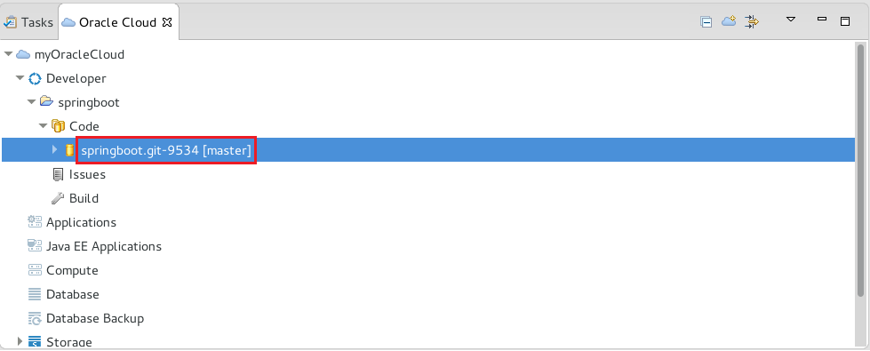
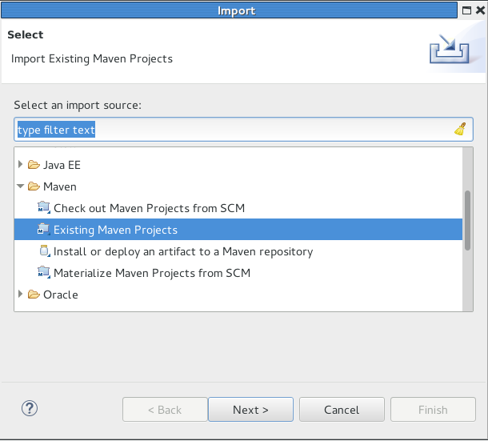
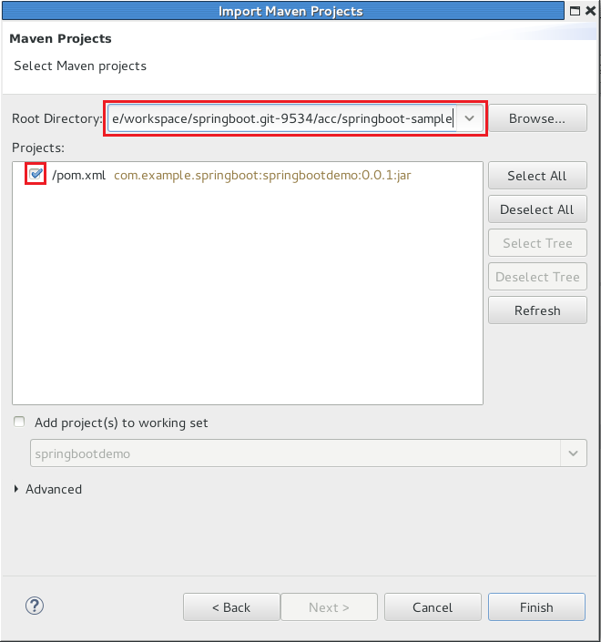
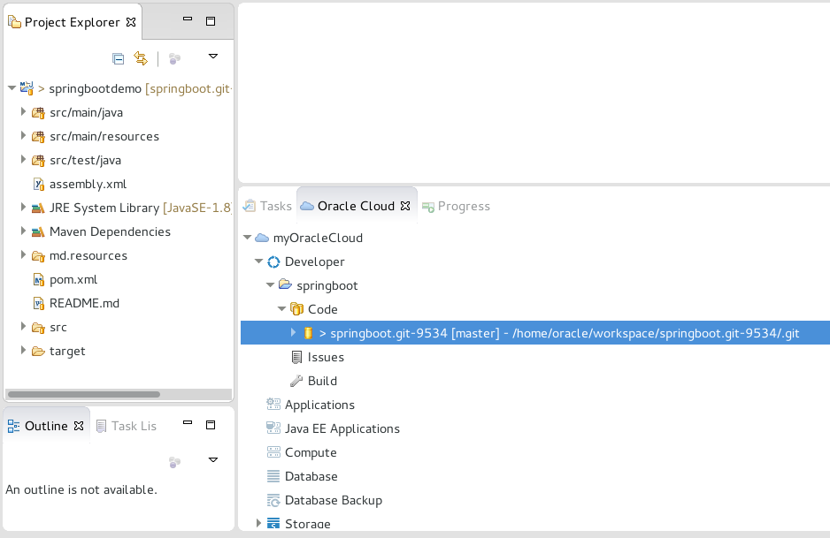

# ORACLE Public Cloud Services tutorial #
-----
## Using Eclipse IDE (Oracle Enterprise Pack for Eclipse) with Oracle Developer Cloud Service ##

### Introduction ###
You can access Oracle Developer Cloud Service projects from Integrated Development Environments (IDEs) such as Oracle Enterprise Pack for Eclipse (OEPE), Oracle JDeveloper, and NetBeans IDE. The Eclipse IDE and the Oracle Enterprise Pack for Eclipse (OEPE) includes integration for Oracle Developer Cloud Service, which conveniently exposes the most common Cloud development tasks from within the IDE.

Oracle Developer Cloud Service integration with the Eclipse IDE includes the following:

+ A dedicated Oracle Cloud view that displays Oracle Developer Cloud Service projects of which you are a member
+ Integration with Mylyn and the Oracle Developer Cloud Service Issues system
+ Source control system integration with the Oracle Developer Cloud Service Git repository

You can download the Eclipse IDE from [http://www.eclipse.org/](http://www.eclipse.org/) and OEPE from [http://www.oracle.com/technetwork/developer-tools/eclipse/downloads/index.html](http://www.oracle.com/technetwork/developer-tools/eclipse/downloads/index.html).

If you are using the Eclipse IDE, download and install the Oracle Cloud Tools plugin from the Eclipse IDE marketplace. In OEPE, the plugin is installed by default.

### About this tutorial ###
This tutorial demonstrates how to:
	
+ Setup Eclipse IDE (Oracle Enterprise Plugin for Eclipse)

### Prerequisites ###

- [Create Oracle Developer Cloud Service project for SpringBoot application](https://github.com/oracle-weblogic/weblogic-innovation-seminars/blob/caf-12.2.1/cloud.demos/jcs.basics/create.devcs.project.springboot.md)
- Eclipse IDE with Oracle Cloud Tools plugin or Oracle Enterprise Plugin for Eclipse installed.

### Steps ###

#### Configure Cloud Tools Plugin ####

Open OEPE and set (leave the default, `home/oracle/workspace`) workspace location. Close the Welcome page. To open the *Oracle Cloud* view from the Window menu, click *Show View* and then *Other*.

From the list open *Oracle Cloud* and select *Oracle Cloud*.

If you are connecting to Oracle Developer Cloud Service for the first time, click the Connect link.

In the Oracle Cloud Service Connection dialog, enter the following:

+ **Data Center**: Select the Oracle Cloud data center.
+ **Identity Domain**: Enter the identity domain of Oracle Developer Cloud Service.
+ **Username** and **Password**: Enter the user name and password.
+ **Connection Name**: Enter a name for the service instance, if necessary. By default, the connection name is set to the identity domain name.

Provide a master password to store securely your credentials, so in the future you don't need to enter every time when you open OEPE. Don't forget to note the master password.

After your credentials have been validated, you are logged in to Oracle Developer Cloud Service and the Oracle Cloud view displays all projects that are assigned to you. Open the tree view myOracle Cloud(Cloud connection name) -> Developer -> springboot(DevCS project name) -> Code and there you can see the Git repository hosted on Oracle Developer Cloud Service.

To clone the Git repository to your machine double click or right click -> Activate on the Git repository and clone will start.

After the successful clone your local copy will be available in your workspace.

To import a Maven based project right click on the Project Exporer area and will pop up the menu where you can select Import projects -> Import...

Select Existing Maven Projects and click Next.

Give the location of the cloned repository. If the workspace location is the default it should look like the following: `/home/oracle/workspace/springboot.git-9534/acc/springboot-sample`
Please note, that you need to give one of the subfolder of the local repository.
Click Finish.

OEPE now starts to validate and build the project which can take few seconds. Finally you can see the imported project in the Project Explorer area.

Now this is time when a developer can start to modify/add code and later push changes to the remote, Developer Cloud Service's Project hosted Git repository.