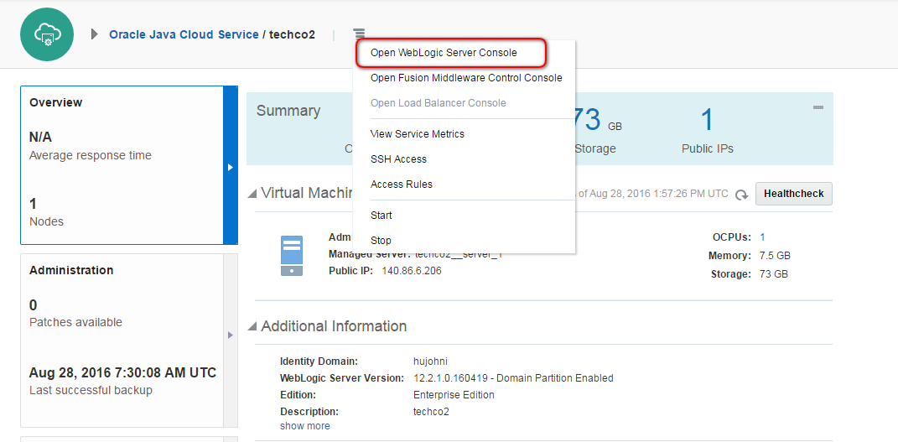
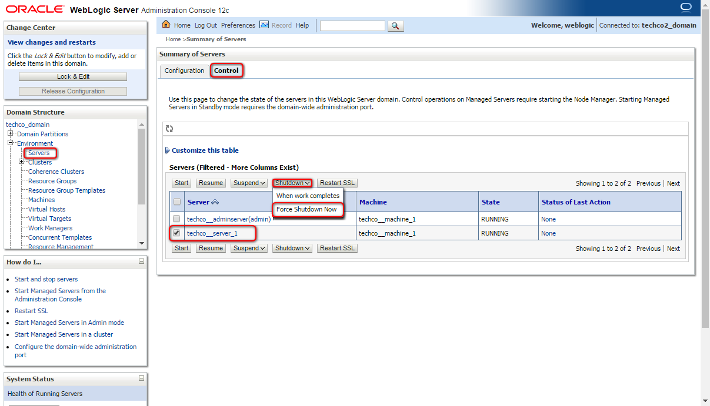

# ORACLE Public Cloud Service tutorial #
-----
## Direct access and management of Oracle Java Cloud Service ##

### About this tutorial ###
You can access the services and resources that a service instance's VM provides by logging into the VM through SSH.
This tutorial demonstrates how to:
	
+ connect to Java Cloud Service's VM using ssh,
+ stop Managed server using Admin console (user interface)
+ change startup properties
+ start Managed server using WLST
+ search pattern in the WebLogic server log(s)

### Prerequisites ###

- [Deployed sample application on Java Cloud Service](https://github.com/oracle-weblogic/weblogic-innovation-seminars/blob/caf-12.2.1/cloud.demos/jcs.basics/deploy.to.jcs.md)
- Before you use the ssh utility to connect to a compute node, you need the following:
- The IP address of a compute node associated with a WebLogic deployment. The IP address is listed on Java Cloud Service Overview page.
- The SSH private key file that matches the public key associated with the deployment.

### Steps ###
Navigate to the Oracle Java Cloud Service Console. [Sign in](https://github.com/oracle-weblogic/weblogic-innovation-seminars/blob/caf-12.2.1/cloud.demos/jcs.basics/sign.in.to.oracle.cloud.md) to the My Services application at [cloud.oracle.com](http://cloud.oracle.com). On the dashboard open the Java Cloud Service Console.

Click the service instance hosts sample application.

Note the public IP address of the compute node hosting Java Cloud Service instance.

#### Connect to Java CLoud Service's VM using ssh ####

Open a terminal and change to folder `/u01/content/weblogic-innovation-seminars/cloud.demos`. 

    $ [oracle@localhost Desktop]$ cd /u01/content/weblogic-innovation-seminars/cloud.demos

Use `ssh` to connect remote VM. First parameter is the private key file location and the second is the remote user (default: **opc**) and remote system's address (the public IP address of instance). It should be the following if your private key's name is **privateKey** and can be found in the same folder where you execute `ssh`. Dont forget to replace the IP address according to your environment property:

    $ [oracle@localhost cloud.demos]$ ssh -i privateKey opc@140.86.6.145
    [opc@techco-wls-1 ~]$

Once the ssh connection established you need to switch user to oracle. It is necessary because opc has no access to instance related files.

	[opc@techco-wls-1 ~]$ sudo su - oracle
	-bash-4.1$

Now the connection is established and the propmt is ready to manage your instance. Leave this terminal open for further usage.

#### Stop Managed Server using Admin Console ####

Change back to browser where Java Cloud Service console is opened. Click on hamburger icon next to the instance name and select Open WebLogic Server Console.

In the navigation tree under the domain name click the Environment node to expand it and then click Servers. The workspace area presents the list of servers that are part of the domain. Click the Control tab. Select a managed server by clicking on its selection checkbox. Click Shutdown -> Force Shutdown Now, to send an immediate shutdown order.

Confirm your order by selecting Yes and wait until it completes.

#### Modify startup script for Managed Server ####

Change to the terminal window where ssh connection is already established. To check what is the startup script for managed server check nodemanager.properties:

	-bash-4.1$ less $DOMAIN_HOME/nodemanager/nodemanager.properties
	#Node manager properties
	#Fri Aug 26 19:25:37 UTC 2016
	DomainsFile=/u01/data/domains/techco_domain/nodemanager/nodemanager.domains
	LogLimit=0
	PropertiesVersion=12.2.1
	AuthenticationEnabled=true
	NodeManagerHome=/u01/data/domains/techco_domain/nodemanager
	JavaHome=/u01/jdk
	LogLevel=FINE
	DomainsFileEnabled=true
	StartScriptName=startJCSServer.sh
	ListenAddress=techco-wls-1
	NativeVersionEnabled=true
	ListenPort=5556
	LogToStderr=true
	SecureListener=true
	LogCount=1
	StopScriptEnabled=false
	QuitEnabled=true
	LogAppend=true
	StateCheckInterval=500
	CrashRecoveryEnabled=true
	StartScriptEnabled=true
	LogFile=/u01/data/domains/techco_domain/nodemanager/nodemanager.log
	LogFormatter=weblogic.nodemanager.server.LogFormatter
	ListenBacklog=50
	UseKSSForDemo=false
	../nodemanager/nodemanager.properties (END) 

The `StartScriptName` property shows the startup script for managed server which is `startJCSServer.sh`. Press q to quit. Open to edit this script. Use vi:

	-bash-4.1$ vi /u01/data/domains/techco_domain/bin/startJCSServer.sh

Press 'i' to edit file. Insert `echo="CUSTOM PROPERTY SETTING"` before `/u01/data/domains/techco_domain/bin/startWebLogic.sh "$@"`. The goal is to demonstrate how you can set e.g. custom property which is necessary for your application. The `startJCSServer.sh` should look similar:

	#!/bin/bash
	# Copyright (c) 2014 Oracle and/or its affiliates. All rights reserved.
	
	# script to set the USER_MEM_ARGS before starting Server
	
	managedServerName=techco__server_1
	patternToBeMatched=`echo $managedServerName | cut -d _ -f 1,2`
	if [ "${SERVER_NAME}" = "techco__adminserver" ]
	then
	   USER_MEM_ARGS="-Djava.security.egd=file:/dev/./urandom"
	   JAVA_OPTIONS="$JAVA_OPTIONS -Dweblogic.rjvm.enableprotocolswitch=true -Djava.net.preferIPv4Stack=true"
	   export JAVA_OPTIONS
	   export USER_MEM_ARGS
	elif [[ $SERVER_NAME =~ $patternToBeMatched ]]
	then
	   # in case of ManagedServer java args are coming from the startup.properties file so no need to set it explicitly. Setting USER_MEM_ARGS to " " so that default values of MEM_ARGS does not come into picture at all
	    USER_MEM_ARGS=" "
	    export USER_MEM_ARGS
	fi
	
	echo "CUSTOM PROPERTY SETTING"
	
	/u01/data/domains/techco_domain/bin/startWebLogic.sh "$@"
	~                                                                                                                                             
	~                                                                                                                                             
	~                                                                                                                                             
	~                                                                                                                                             
	~                                                                                                                                             
	-- INSERT -- 

Before starting the managed server check that there is no such entry in log files belong to the managed server:

	-bash-4.1$ grep -C 4 'CUSTOM PROPERTY' /u01/data/domains/techco_domain/servers/techco__server_1/logs/techco__server_1.*
	-bash-4.1$ 

As you can see there is no such line in the log files. Now start the Managed Server.

#### Using WLST Commands to Start Managed Server ####

Change directory `/u01/app/oracle/middleware/oracle_common/common/bin/` and run wlst.sh to enter the WLST Command Line Interface.

	-bash-4.1$ cd /u01/app/oracle/middleware/oracle_common/common/bin/
	-bash-4.1$ ./wlst.sh 

	Initializing WebLogic Scripting Tool (WLST) ...
	
	Welcome to WebLogic Server Administration Scripting Shell
	
	Type help() for help on available commands
	
	wls:/offline>

As a first step you need to connect to the NodeManager that manages the target server. Execute nmConnect(<username>,<password>,<nodemanager-host>,<nodemanager-port>,<domain-name>,<domain-folder>,<nodemanager-type>) to connect node manager.

	wls:/offline> nmConnect('weblogic', '<password>', 'techco-wls-1', '5556', 'techco_domain', '/u01/data/domains/techco_domain', 'SSL')
	Connecting to Node Manager ...
	Successfully Connected to Node Manager.
	wls:/nm/techco_domain> 

Node manager accepted the connections use nmStart(<servername>) to start managed server.

	wls:/nm/techco_domain> nmStart('techco__server_1')
	Starting server techco__server_1 ...
	Successfully started server techco__server_1 ...
	wls:/nm/techco_domain> exit()

#### Search pattern in the WebLogic server log(s) ####

When the managed server has been started check the log files again for the result. The `-C 5` argument ensures that `grep` displays 5 lines more before and after the pattern have been found:

	-bash-4.1$ grep -C 5 'CUSTOM PROPERTY' $DOMAIN_HOME/servers/techco__server_1/logs/techco__server_1.*
	/u01/data/domains/techco_domain/servers/techco__server_1/logs/techco__server_1.out-<Aug 28, 2016 5:11:12 PM UTC> <FINEST> <NodeManager> <Environment: QTLIB=/usr/lib64/qt-3.3/lib>
	/u01/data/domains/techco_domain/servers/techco__server_1/logs/techco__server_1.out-<Aug 28, 2016 5:11:12 PM UTC> <FINEST> <NodeManager> <Environment: HOME=/u01/app/oracle/tools/paas/state/homes/oracle>
	/u01/data/domains/techco_domain/servers/techco__server_1/logs/techco__server_1.out-<Aug 28, 2016 5:11:12 PM UTC> <FINEST> <NodeManager> <Environment: UTILS_MEM_ARGS=-Xms32m -Xmx1024m>
	/u01/data/domains/techco_domain/servers/techco__server_1/logs/techco__server_1.out-<Aug 28, 2016 5:11:12 PM UTC> <INFO> <NodeManager> <Working directory is '/u01/data/domains/techco_domain'>
	/u01/data/domains/techco_domain/servers/techco__server_1/logs/techco__server_1.out-<Aug 28, 2016 5:11:12 PM UTC> <INFO> <NodeManager> <Server output log file is '/u01/data/domains/techco_domain/servers/techco__server_1/logs/techco__server_1.out'>
	/u01/data/domains/techco_domain/servers/techco__server_1/logs/techco__server_1.out:CUSTOM PROPERTY SETTING
	/u01/data/domains/techco_domain/servers/techco__server_1/logs/techco__server_1.out-.
	/u01/data/domains/techco_domain/servers/techco__server_1/logs/techco__server_1.out-.
	/u01/data/domains/techco_domain/servers/techco__server_1/logs/techco__server_1.out-JAVA Memory arguments:  
	/u01/data/domains/techco_domain/servers/techco__server_1/logs/techco__server_1.out-.
	/u01/data/domains/techco_domain/servers/techco__server_1/logs/techco__server_1.out-CLASSPATH=/u01/app/oracle/middleware/oracle_common/modules/features/com.oracle.db.jdbc7-dms.jar:/u01/jdk/lib/tools.jar:/u01/app/oracle/middleware/wlserver/server/lib/weblogic.jar:/u01/app/oracle/middleware/wlserver/../oracle_common/modules/net.sf.antcontrib_1.1.0.0_1-0b3/lib/ant-contrib.jar:/u01/app/oracle/middleware/wlserver/modules/features/oracle.wls.common.nodemanager.jar:/u01/app/oracle/middleware/oracle_common/modules/oracle.jps/jps-manifest.jar:/u01/app/oracle/middleware/oracle_common/modules/internal/features/jrf_wlsFmw_oracle.jrf.wls.classpath.jar::/u01/app/oracle/middleware/wlserver/common/derby/lib/derbynet.jar:/u01/app/oracle/middleware/wlserver/common/derby/lib/derbyclient.jar:/u01/app/oracle/middleware/wlserver/common/derby/lib/derby.jar:/u01/jdk/lib/tools.jar:/u01/app/oracle/middleware/oracle_common/modules/oracle.jps/jps-manifest.jar
	-bash-4.1$ 

The "property" can be found in `/u01/data/domains/techco_domain/servers/techco__server_1/logs/techco__server_1.out`. Use exit command to log out from the ssh connection.

Note this is one way to check log file(s) related to Java Cloud Service. There are many other way to have the log content. You can use:

+ [WebLogic Administration Console](http://docs.oracle.com/cloud/latest/jcs_gs/JSCUG/GUID-6EBA48D9-F5FB-4AE1-9573-937ABE9EBD0C.htm#JSCUG3386)
+ Oracle Management Cloud - [Log Analytics](https://docs.oracle.com/cloud/latest/em_home/em_log_admin_tasks.htm)
+ More about Monitoring and Tuning of Java Cloud Service see the [documentation](http://docs.oracle.com/cloud/latest/jcs_gs/jcs_monitortune_12.1.3.htm).
